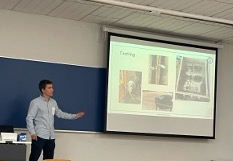

# Bachelor Thesis for the Bachelor Degree in Telecommunication Engineering

## Title: Proof-of-Concept Design of a Distributed IoT System with Edge Computing \& Storage Requirements

---

This work has been awarded a grade of 9.4/10 and it has been done by [Andres Navarro Pedregal](https://www.linkedin.com/in/andresnav) under the supervision of David Larrabeiti López.

You can find the latex template used [here](https://github.com/andres-nav/templates/blob/main/thesis_uc3m.sty).

### Abstract

This bachelor thesis presents the design of a distributed IoT system with edge computing and storage requirements. The target proof-of-concept application selected for this is a smart distributed parking management system tailored for multi-condominium control.The project addresses the growing challenges of urban parking management through an innovative approach that combines edge computing with cloud services. Indeed, the reqruiements of such system can be found in many other smart city applications that include edge computing capabilities to reduce network resources (in this case, licence plate detection), sensors and actuators (in this case, actuate in the parking system, turn on lights, etc.), and edge storage or caching to reduce latency and increase resilience.

The system employs a distributed architecture where each community operates autonomously while maintaining centralized oversight. Key components include license plate recognition using machine learning, automated access control, and a web-based management interface. The solution utilizes NVIDIA Jetson Nano devices for edge processing, custom relay boards for hardware control, and AWS cloud infrastructure for centralized management.

The system has been successfully deployed across ten communities in Valencia, Spain, demonstrating its scalability and reliability in real-world conditions. The implementation incorporates robust security measures, including encrypted databases, secure network communications via ZeroTier, and SMS-based user authentication.

This work contributes to the field of smart city infrastructure by providing a practical, scalable solution for community parking management that balances autonomy with centralized control. It sets a foundation for future expansion and enhancement of urban parking solutions and other IoT applications.
